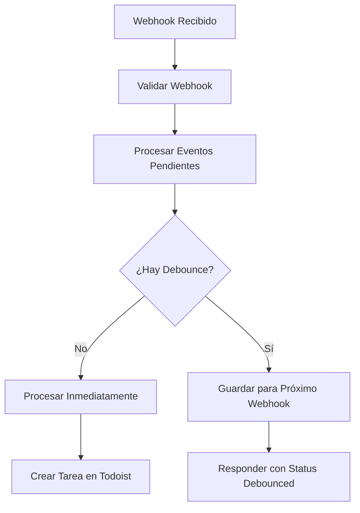

# Actualización del Sistema de Webhooks para Vercel

## Problema Identificado

El webhook de Notion estaba recibiendo eventos correctamente pero no creaba tareas en Todoist debido a incompatibilidades con el entorno serverless de Vercel:

1. **Timeout de Funciones Serverless**: Las funciones de Vercel tienen un tiempo de ejecución limitado
2. **setTimeout en Serverless**: Los timeouts diferidos no funcionan correctamente en entornos serverless
3. **Debouncing Inadecuado**: El tiempo de debounce de 60 segundos era demasiado largo para Vercel

## Cambios Realizados

### 1. **Refactorización del Sistema de Debouncing**

**Antes**: 
- Los eventos se programaban con `setTimeout` para ejecutarse después de 60 segundos
- La función respondía inmediatamente pero el procesamiento real nunca ocurría

**Ahora**:
- **Procesamiento inmediato** cuando no hay conflicto de debounce
- **Debounce inteligente** solo cuando es necesario
- **Procesamiento de eventos pendientes** en cada nueva petición

### 2. **Reducción del Tiempo de Debounce**

```typescript
// Antes
debounceTime: 60000, // 60 segundos

// Ahora  
debounceTime: 10000, // 10 segundos
```

### 3. **Configuración de Vercel**

Se agregó `vercel.json` para configurar timeouts apropiados:

```json
{
  "functions": {
    "src/app/api/notion-webhook/route.ts": {
      "maxDuration": 30
    },
    "src/app/api/todoist-webhook/route.ts": {
      "maxDuration": 30
    }
  }
}
```

### 4. **Nuevo Flujo de Procesamiento**



## Comportamiento Actual

### Primer Evento para una Página
- ✅ Se procesa **inmediatamente**
- ✅ Se crea la tarea en Todoist
- ✅ Respuesta: `"Event processed successfully"`

### Eventos Subsecuentes (dentro de 10 segundos)
- ⏰ Se aplica debounce
- 💾 Se guarda para el próximo webhook
- ✅ Respuesta: `"Event debounced - will be processed on next webhook or after cooldown"`

### Próximo Webhook (después de 10 segundos)
- 🔄 Se procesan eventos pendientes automáticamente
- ✅ Se actualiza la tarea en Todoist

## Testing

### Tests Unitarios Actualizados
```bash
npm test
```

### Test de Integración para Vercel
```bash
# Para ambiente local
npm run test:webhook:vercel

# Para ambiente de producción
WEBHOOK_URL=https://tu-dominio.com/api/notion-webhook npm run test:webhook:vercel
```

## Beneficios de los Cambios

1. **🚀 Procesamiento Inmediato**: Las tareas se crean inmediatamente cuando no hay conflictos
2. **⚡ Compatibilidad con Serverless**: Eliminación de dependencias de setTimeout diferidos
3. **🛡️ Debouncing Eficiente**: Solo se aplica cuando es realmente necesario
4. **🔄 Auto-recuperación**: Los eventos pendientes se procesan automáticamente
5. **📊 Mejor Logging**: Logs más claros sobre el estado del procesamiento

## Monitoreo

Los logs ahora muestran claramente:
- ✅ `"Processing event immediately - no recent processing detected"`
- ⏰ `"Page recently processed, scheduling latest event"`
- 🔄 `"Processing pending event that exceeded debounce time"`

## Variables de Entorno Requeridas

Asegúrate de que estén configuradas en Vercel:
- `TODOIST_API_TOKEN`
- `NOTION_USER_ID` (opcional)
- `TODOIST_PROJECT_ID` (opcional)
- `OPENAI_API_KEY` (opcional)

## Próximos Pasos

1. ✅ Deploy a Vercel con los nuevos cambios
2. 🧪 Probar con webhooks reales de Notion
3. 📊 Monitorear logs para verificar funcionamiento
4. 🔧 Ajustar tiempo de debounce si es necesario (actualmente 10 segundos)
